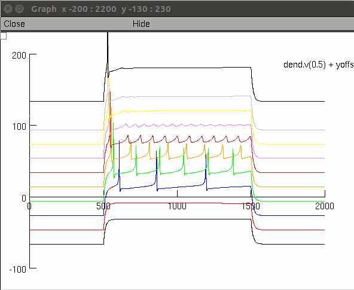

This is the readme for the author's model associated with **Supplementary Figure 12** in the paper:
Gidon A, Zolnik TA, Fidzinski P, Bolduan F, Papoutsi A, Poirazi P, Holtkamp M, Vida I, Larkum ME (2020) Dendritic action potentials and computation in human layer 2/3 cortical neurons Science 367:83-87, http://dx.doi.org/10.1126/science.aax6239

The author's models associated with supplementary figure 3 and S9 is available here: http://modeldb.yale.edu/254217

### Model usage:
This code was written in and requires NEURON (tested in version 7.4, 7.7) which is freely available from http://www.neuron.yale.edu.

This model was run under the unix/linux and windows 10 operating system.

Proceed as follows:
- Download and expand this archive and compile the mod files located in the `\_mod` folder with `nrnivmodl` (`nrnivmodl _mod` or `nrnivmodl ../_mod` if running in the FigS12 subfolder).

run the demo for unix/linux:
```
x84/64/special mosinit.hoc
```
or for windows double click `mosinit.hoc`

If you need more help running NEURON on your platform please consult: https://senselab.med.yale.edu/ModelDB/NEURON_DwnldGuide

Once the code is running you can "tickle" the taur_cad time constant in the window:


For example, by clicking the check box twice, or by entering a return after the 60, a graph similar to Fig S12 B2 is generated:


