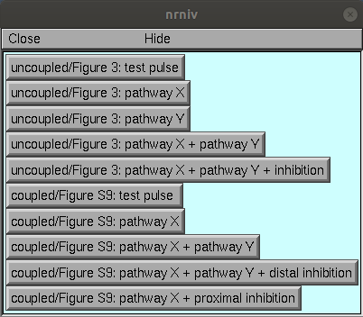
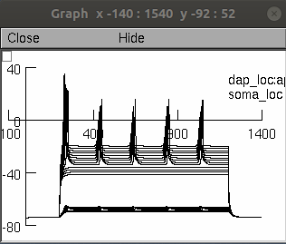
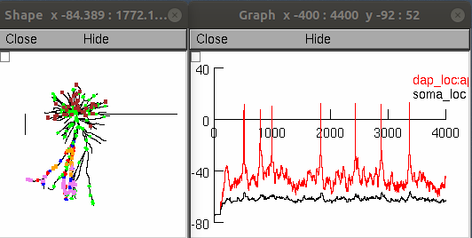
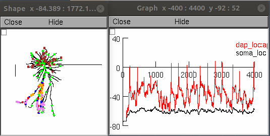

# Biophysical cell

This is the readme for the author's model which replicates **Figure 3** and **Supplementary Figure 9** in the paper:
Gidon A, Zolnik TA, Fidzinski P, Bolduan F, Papoutsi A, Poirazi P, Holtkamp M, Vida I, Larkum ME (2020) Dendritic action potentials and computation in human layer 2/3 cortical neurons Science 367:83-87, http://dx.doi.org/10.1126/science.aax6239

The author's models associated with **Supplementary Figure 12** is available here: http://modeldb.yale.edu/260178 or under `FigS12codes/` subdirectory of this repo.

Model usage:
This code was written in and requires NEURON (tested in version 7.4, 7.7) which is freely available from http://www.neuron.yale.edu</a>

This model was run under the unix/linux and windows 10 operating system.

Proceed as follows:

- Download and expand this archive and compile the mod files located in the "\_mod" folder with `nrnivmodl` (`nrnivmodl _mod` or `nrnivmodl ../_mod` if running in the Fig3andS9 subfolder).

### run the demo for unix/linux:
```
x84/64/special mosinit.hoc
```
or for windows double click `mosinit.hoc`

If you need more help running NEURON on your platform please consult: https://senselab.med.yale.edu/ModelDB/NEURON_DwnldGuide

Once the code is running you can select a simulation from a menu of buttons to click:




After each simulation is run you will need to restart to generate another simulation. As examples clicking the first, second, and fith buttons quickly generates these figures:
<br>





